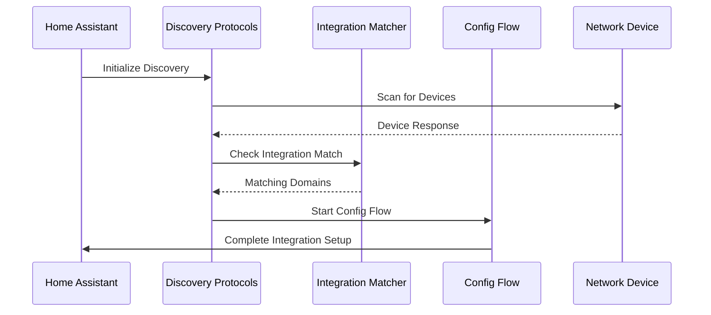

# Auto Integration Detection System

## Discovery Protocols & Methods

### 1. SSDP (Simple Service Discovery Protocol)
- **Purpose**: Discovery of UPnP/DLNA devices
- **Implementation**: `homeassistant/components/ssdp/`
- **Key Components**:
  - Scanner: Manages device discovery
  - IntegrationMatchers: Matches devices to integrations
- **Use Cases**: Media players, network cameras, smart TVs

### 2. Zeroconf (mDNS/Bonjour)
- **Purpose**: Local network service discovery
- **Implementation**: `homeassistant/components/zeroconf/`
- **Key Components**:
  - ZeroconfManager: Handles service discovery
  - ServiceBrowser: Monitors for new services
- **Use Cases**: Printers, IoT devices, local services

### 3. DHCP Discovery
- **Purpose**: Network device discovery via DHCP
- **Implementation**: `homeassistant/components/dhcp/`
- **Key Components**:
  - DHCPWatcher: Monitors DHCP traffic
  - IntegrationMatchers: Matches devices to integrations
- **Use Cases**: Network devices, IoT hubs

### 4. Bluetooth Discovery
- **Purpose**: Bluetooth device discovery
- **Implementation**: `homeassistant/components/bluetooth/`
- **Key Components**:
  - BluetoothScanner: Manages device scanning
  - AdvertisementTracker: Tracks device presence
- **Use Cases**: BLE devices, sensors, beacons

### 5. HomeKit Discovery
- **Purpose**: Apple HomeKit device discovery
- **Implementation**: `homeassistant/components/homekit_controller/`
- **Key Components**:
  - HomeKitScanner: Discovers HomeKit devices
  - PairingManager: Handles device pairing
- **Use Cases**: HomeKit-compatible devices

### 6. Cloud SDK Discovery
- **Purpose**: Cloud-connected device discovery
- **Implementation**: Various cloud integrations
- **Key Components**:
  - CloudAPI: Interfaces with cloud services
  - DeviceManager: Manages discovered devices
- **Use Cases**: Cloud-connected devices, services

### 7. Manual Configuration
- **Purpose**: User-initiated device setup
- **Implementation**: Integration-specific config flows
- **Key Components**:
  - ConfigFlow: Guides user through setup
  - OptionsFlow: Manages configuration options
- **Use Cases**: Complex devices, custom setups

### 8. MQTT Discovery
- **Purpose**: Automatic discovery of devices via MQTT messages
- **Implementation**: `homeassistant/components/mqtt/`
- **Key Components**:
  - MQTTClient: Manages MQTT connections
  - DiscoveryManager: Handles device discovery messages
  - EntityManager: Manages discovered entities
- **Use Cases**: 
  - Custom IoT devices
  - Bridge-style integrations (e.g., Zigbee2MQTT, ESPHome)
  - DIY home automation projects
- **Discovery Process**:
  1. Device publishes discovery message to `homeassistant/<component>/<node_id>/config`
  2. Message contains device and entity configuration
  3. Home Assistant creates entities based on configuration
  4. Device publishes state updates to configured topics
- **Configuration Format**:
  ```json
  {
    "name": "Device Name",
    "state_topic": "device/status",
    "value_template": "{{ value_json.temperature }}",
    "device_class": "temperature",
    "unit_of_measurement": "°C",
    "device": {
      "identifiers": ["device_id"],
      "name": "Device Name",
      "manufacturer": "Manufacturer",
      "model": "Model"
    }
  }
  ```

## Integration Matching System

1. **Manifest-based Matching**:
   ```python
   # Example manifest.json discovery configuration
   {
     "ssdp": [
       {
         "manufacturer": "Example Corp",
         "modelName": "Smart Device"
       }
     ],
     "zeroconf": [
       "_example._tcp.local."
     ],
     "dhcp": [
       {
         "hostname": "example-*",
         "macaddress": "00:11:22:*"
       }
     ],
     "mqtt": [
       {
         "topic": "homeassistant/sensor/+/config",
         "payload": {
           "device": {
             "identifiers": ["device_id"]
           }
         }
       }
     ]
   }
   ```

2. **Protocol-specific Matchers**:
   - SSDP: Matches UPnP device descriptions
   - Zeroconf: Matches service types and properties
   - DHCP: Matches hostnames and MAC addresses
   - Bluetooth: Matches device names and services
   - HomeKit: Matches device identifiers
   - Cloud: Matches device identifiers and types
   - MQTT: Matches discovery topics and device identifiers

## Configuration Flow System

1. **Protocol-specific Steps**:
   - `async_step_ssdp()`: SSDP device setup
   - `async_step_zeroconf()`: Zeroconf service setup
   - `async_step_dhcp()`: DHCP device setup
   - `async_step_bluetooth()`: Bluetooth device setup
   - `async_step_homekit()`: HomeKit device setup
   - `async_step_cloud()`: Cloud device setup
   - `async_step_user()`: Manual configuration

2. **Common Flow Elements**:
   - Device identification
   - Authentication/credentials
   - Device-specific options
   - Integration settings

## Call Flow Diagram



## Navigation & Diving In

1. **Core Components**:
   - [SSDP Scanner](../homeassistant/components/ssdp/scanner.py)
   - [Zeroconf Manager](../homeassistant/components/zeroconf/__init__.py)
   - [DHCP Watcher](../homeassistant/components/dhcp/__init__.py)
   - [Bluetooth Scanner](../homeassistant/components/bluetooth/__init__.py)
   - [HomeKit Scanner](../homeassistant/components/homekit_controller/__init__.py)

2. **Example Integrations**:
   - [Sonos Integration](../homeassistant/components/sonos/)
   - [Samsung TV Integration](../homeassistant/components/samsungtv/)
   - [Philips Hue Integration](../homeassistant/components/hue/)
   - [HomeKit Controller](../homeassistant/components/homekit_controller/)

3. **Next Steps**:
   - Review integration manifest files for discovery patterns
   - Study configuration flow implementations
   - Analyze error handling in discovery process
   - Explore protocol-specific matching strategies 