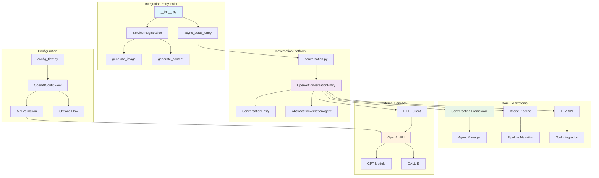

# OpenAI Conversation Integration

## Feature Purpose & Scope

The OpenAI Conversation integration provides AI-powered conversational capabilities to Home Assistant by connecting to OpenAI's APIs (GPT models and DALL-E). This integration serves as a conversation agent that can:

- Process natural language user inputs and generate intelligent responses
- Integrate with Home Assistant's Assist Pipeline for voice and text conversations  
- Control Home Assistant entities through natural language when LLM API access is enabled
- Generate images using DALL-E models
- Support streaming responses for real-time conversation experiences
- Handle multi-modal inputs (text, images, PDFs) for enhanced context understanding

**Primary use-cases:**
- Voice assistants powered by OpenAI's language models
- Conversational home automation control ("Turn on the living room lights")
- AI-generated content creation through Home Assistant services
- Smart home Q&A and assistance with context awareness

## Internal Architecture

**Data Flow:**
1. User input → Conversation Framework → OpenAI Conversation Entity
2. Entity processes input through OpenAI API with streaming support
3. Responses flow back through chat logs and conversation results
4. Tool calls (if enabled) interact with Home Assistant's LLM API
5. Pipeline integration enables voice-to-text-to-AI-to-text-to-speech workflows

## Key Technical Concepts & Design Patterns

**1. Entity-based Agent Pattern**
- Inherits from both `ConversationEntity` and `AbstractConversationAgent`
- Provides a Home Assistant entity interface for conversation capabilities
- Enables state tracking and device representation

**2. Streaming Response Handler**
- Implements `_transform_stream()` to convert OpenAI delta events to HA format
- Handles real-time conversation updates for responsive user experience
- Manages various event types: text deltas, tool calls, completions, errors

**3. Integration Registry Pattern**
- Self-registers with HA's conversation agent manager via `conversation.async_set_agent()`
- Integrates with assist pipeline through `assist_pipeline.async_migrate_engine()`
- Follows HA's standard config entry lifecycle

**4. Service-oriented Architecture**
- Exposes domain-specific services (`generate_image`, `generate_content`)
- Separates conversation capabilities from direct API access
- Validates config entries and handles service-level errors

**5. Tool Integration Pattern**
- Transforms HA's LLM API tools into OpenAI function calling format
- Manages iterative tool execution loops with MAX_TOOL_ITERATIONS safety
- Converts between HA and OpenAI tool call representations

## Dependencies & Integration Points

**Core Home Assistant Dependencies:**
- `conversation`: Base conversation framework and agent management
- `assist_pipeline`: Voice assistant pipeline integration and migration
- `llm`: Large language model API for Home Assistant control
- `config_entries`: Configuration entry management
- `httpx_client`: HTTP client for OpenAI API calls

**After Dependencies (from manifest):**
- `assist_pipeline`: Ensures pipeline system is ready for engine migration
- `intent`: Intent processing system for conversation results

**External API Integration:**
- OpenAI REST API (v1) for completions and image generation
- Streaming WebSocket-like interface for real-time responses
- Authentication via API key stored in config entry

**Cross-module Integration:**
- Registers as conversation agent in global agent manager
- Provides engine migration path for existing assist pipelines  
- Exposes services for programmatic access to OpenAI capabilities
- Integrates with HA's device registry for service device representation

## Error Handling & Edge Cases

**API Error Handling:**
- `RateLimitError`: Translates to "Rate limited or insufficient funds" message
- `AuthenticationError`: Returns generic "Error talking to OpenAI" for security
- `OpenAIError`: Generic error wrapper with specific error message passthrough
- Network timeouts and connection failures handled by httpx client

**Streaming Response Errors:**
- `ResponseIncompleteEvent`: Handles max tokens, content filter, and unknown failures
- `ResponseFailedEvent`: Processes API-level failures with usage tracking
- `ResponseErrorEvent`: Handles real-time streaming errors

**Configuration Validation:**
- Model compatibility checks (UNSUPPORTED_MODELS list)
- Web search feature availability validation per model
- File access validation for multi-modal inputs (allowlist_external_dirs)
- API key validation during setup

**Edge Cases:**
- Graceful handling of missing config entries in services
- File type validation for uploads (images and PDFs only)
- Tool call iteration limits to prevent infinite loops
- Conversation ID management for session continuity

## Testing & Validation

**Test Strategy:**
- **Unit Tests**: Located in `tests/components/openai_conversation/`
  - `test_init.py`: Integration setup and service testing
  - `test_conversation.py`: Conversation entity behavior and streaming
  - `test_config_flow.py`: Configuration flow validation

**Test Utilities:**
- `MockConfigEntry`: Simulates integration configuration
- `mock_create_stream`: Mocks OpenAI streaming responses with event generation
- `MockChatLog`: Tests conversation logging and state management

**Integration Testing:**
- Conversation agent registration and discovery
- Assist pipeline migration scenarios  
- Tool calling with Home Assistant LLM API
- Multi-modal input processing (files, images)

**Mocking Strategy:**
- OpenAI API responses mocked at the HTTP client level
- Streaming events generated programmatically for deterministic testing
- Configuration validation tested with various invalid inputs

## Related Notes & Documentation

- `/notes/features/conversation-framework.md` - Core conversation system architecture that this integration extends
- `/notes/features/assist-pipeline.md` - Voice assistant pipeline that integrates with OpenAI conversation
- `/notes/features/llm-api.md` - Home Assistant's LLM API that enables tool calling capabilities

## Next Steps for Engineers

**Known Limitations:**
- Limited file type support (images and PDFs only)
- Model-specific feature restrictions (web search availability)
- Tool call iteration limits may be too restrictive for complex scenarios
- No support for function calling with non-assist API configurations

**Refactor Opportunities:**
- Extract common streaming response handling for reuse by other AI integrations
- Implement retry logic with exponential backoff for transient API failures
- Add configuration validation for cost controls (max tokens, rate limits)
- Consider implementing conversation memory management

**Performance Tuning:**
- Cache model capabilities to reduce API calls during validation
- Implement request batching for multiple rapid interactions
- Add metrics collection for API usage and response times
- Optimize file encoding for large multi-modal inputs

**Observability Improvements:**
- Add structured logging for conversation flows and API interactions
- Implement trace context propagation through streaming responses
- Add performance metrics for conversation latency and token usage
- Enhanced error reporting with conversation context 