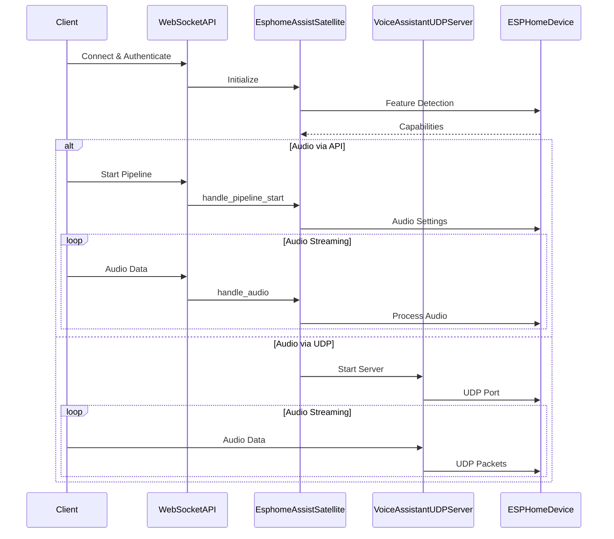

# ESPHome Assist Satellite Integration

## Entry Point

The integration entry point is in `homeassistant/components/esphome/assist_satellite.py`:

- **Main Class**: `EsphomeAssistSatellite`
- **Setup Function**: `async_setup_entry`
- **Integration Path**: `homeassistant/components/esphome/__init__.py` -> `assist_satellite.py`

## Strategy Design Overview

The ESPHome Assist Satellite integration serves as a bridge between Home Assistant's voice assistant system and ESPHome devices. It enables:

1. **Voice Assistant Capabilities**: Allows ESPHome devices to act as voice assistant satellites
2. **Real-time Audio Processing**: Handles audio streaming and processing
3. **Bi-directional Communication**: Manages both command and audio data flow
4. **Device Integration**: Provides a standardized interface for ESPHome devices to participate in voice assistant functionality

This integration is crucial for:
- Extending voice assistant capabilities to ESPHome devices
- Enabling real-time audio processing at the edge
- Providing a standardized interface for voice assistant features

## High-Level Flow Overview

The integration follows this flow:

1. **Initialization**:
   - Device discovery and setup
   - Feature capability detection
   - Handler registration

2. **Communication Model**:
   - Hybrid push/pull model
   - Initial commands are pushed from client
   - Audio streaming uses a combination of push/pull based on feature flags

3. **Key Technical Concepts**:
   - WebSocket binary message handling
   - Async audio streaming
   - Feature flag-based capability detection
   - Event-driven pipeline management

4. **Decision Points**:
   - Audio transport selection (UDP vs API)
   - Pipeline stage management
   - Wake word handling
   - TTS format selection

## Special Notes & Comments

### USERNOTE Comments
```python
# USERNOTE: This instance is initialized in auth.py during the auth phase.
# USERNOTE: websocket_api/http.py -> websocket_api/auth.py -> websocket_api/connection.py
```
- Context: Connection initialization flow
- Type: Implementation detail
- Impact: Important for understanding the connection lifecycle

### USERQ Comments
```python
# USERQ: Why do we limit it to 255 handler slots?
```
- Context: Binary handler registration
- Type: Design decision
- Impact: Understanding system limitations

### LLM Comments
```python
# LLM: Interface Documentation
# Purpose: Registers a binary message handler for the current websocket connection
```
- Context: Binary handler registration
- Type: Implementation documentation
- Impact: Clarifies the purpose and constraints of the handler system

## Entities

### Core Entities

1. **EsphomeAssistSatellite**
   - File: `assist_satellite.py`
   - Purpose: Main integration entity
   - Key Methods:
     - `async_setup_entry`: Initial setup
     - `handle_pipeline_start`: Pipeline initialization
     - `handle_audio`: Audio data processing

2. **VoiceAssistantUDPServer**
   - File: `assist_satellite.py`
   - Purpose: UDP audio streaming
   - Key Methods:
     - `datagram_received`: Audio packet handling
     - `send_audio_bytes`: Audio transmission

3. **ActiveConnection**
   - File: `connection.py`
   - Purpose: WebSocket connection management
   - Key Methods:
     - `async_register_binary_handler`: Handler registration
     - `async_handle_binary`: Binary message processing

## Call Flow Diagram



## Navigation & Diving In

### Key Files
- `homeassistant/components/esphome/assist_satellite.py`: Main integration
- `homeassistant/components/websocket_api/connection.py`: WebSocket handling
- `homeassistant/components/websocket_api/auth.py`: Authentication

### Next Steps
1. Explore `assist_satellite.py` for:
   - Pipeline management
   - Audio streaming implementation
   - Feature flag handling

2. Investigate `connection.py` for:
   - Binary message handling
   - Handler registration system
   - Connection lifecycle

3. Review `auth.py` for:
   - Authentication flow
   - Security considerations
   - Connection initialization 