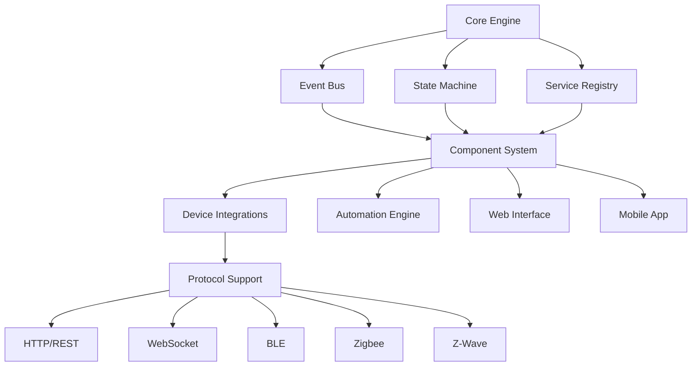

# Home Assistant Architecture Overview

## 1. Repository Purpose & Scope

Home Assistant is an open-source home automation platform that prioritizes local control and privacy. It serves as a central hub for smart home devices and automation, with the following key characteristics:

- **Primary Business Goals**:
  - Provide a privacy-focused, local-first home automation solution
  - Enable seamless integration of diverse smart home devices
  - Support extensive customization and automation capabilities
  - Foster a community-driven development approach

- **Major Features**:
  - Device integration and management
  - State tracking and event handling
  - Service-based architecture for device control
  - Automation and scripting capabilities
  - Web-based user interface
  - Mobile app support
  - Local and remote access options

## 2. High-Level Architecture

The architecture follows a modular, event-driven design with these key components:

- **Core Engine**: Central orchestrator managing the event bus, state machine, and service registry
- **Event Bus**: Handles event propagation and subscription management
- **State Machine**: Tracks and manages entity states
- **Service Registry**: Manages service definitions and execution
- **Component System**: Modular system for device integrations and core features
- **Protocol Support**: Various communication protocols for device integration

## 3. Core Technical Concepts & Patterns

### Event-Driven Architecture
- **Implementation**: `homeassistant/core.py` - EventBus class
- **Rationale**: Enables loose coupling between components and real-time state updates
- **Key Features**: Event propagation, filtering, and async handling

### State Management
- **Implementation**: `homeassistant/core.py` - StateMachine class
- **Rationale**: Centralized state tracking for all entities
- **Key Features**: State persistence, change tracking, and domain filtering

### Service-Oriented Architecture
- **Implementation**: `homeassistant/core.py` - ServiceRegistry class
- **Rationale**: Standardized interface for device control and automation
- **Key Features**: Service registration, validation, and execution

### Async Programming
- **Implementation**: Throughout codebase using Python's asyncio
- **Rationale**: Efficient handling of I/O operations and concurrent tasks
- **Key Features**: Async/await patterns, task management, and event loop integration

## 4. Common Modules & Shared Libraries

### Core Utilities
- `homeassistant/util/`: General-purpose utilities
- `homeassistant/helpers/`: Helper functions for component development
- `homeassistant/auth/`: Authentication and authorization system

### Integration Support
- `homeassistant/components/`: Device and service integrations
- `homeassistant/backports/`: Compatibility layer for older Python versions
- `homeassistant/brands/`: Device brand information and metadata

## 5. Coding Conventions & Standards

### Python Standards
- Python 3.13+ compatibility
- Type hints throughout codebase
- Async/await for I/O operations
- Comprehensive test coverage

### Code Organization
- Modular component structure
- Clear separation of concerns
- Consistent naming conventions
- Extensive documentation

### Quality Assurance
- MyPy for static type checking
- Ruff for linting
- Pre-commit hooks for code quality
- Continuous integration testing

## 6. Strategic Design Goals

### Scalability
- Modular architecture for easy extension
- Efficient state management
- Optimized event handling

### Maintainability
- Clear code organization
- Comprehensive documentation
- Strong typing system

### Performance
- Async I/O operations
- Efficient state tracking
- Optimized event propagation

### Security
- Local-first approach
- Secure authentication
- Privacy-focused design

## 7. Relationships to Individual Flows

The codebase supports various flows through its component system:

- **Device Integration**: `homeassistant/components/` - Device-specific implementations
- **Automation**: `homeassistant/components/automation/` - Automation rule engine
- **User Interface**: `homeassistant/components/frontend/` - Web interface
- **Mobile App**: `homeassistant/components/mobile_app/` - Mobile integration

## 8. Next Steps for Architects & Engineers

### Areas for Investigation
- Review event propagation optimization in `homeassistant/core.py`
- Analyze state machine performance in high-load scenarios
- Evaluate service registry scalability

### Refactoring Opportunities
- Modernize legacy component implementations
- Optimize event filtering mechanisms
- Enhance type safety in core components

### Documentation Needs
- Expand component development guides
- Document performance optimization strategies
- Create architecture decision records 