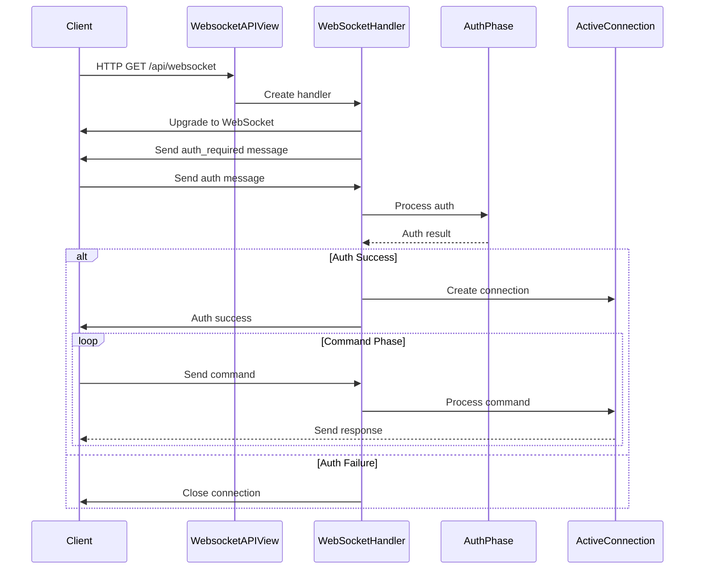

# WebSocket API Documentation

## Overview

The WebSocket API serves as the primary real-time communication channel between Home Assistant's core and its frontend clients. This documentation covers the key aspects of the WebSocket implementation.

## Core Concepts

1. [Message Handling](message_handling.md)
   - Message queuing and processing
   - Writer task management
   - Connection lifecycle

2. [Message Coalescing](message_coalescing.md)
   - Event loop integration
   - Message batching
   - Performance optimization

3. [Backpressure Management](backpressure_management.md)
   - Queue monitoring
   - Resource protection
   - Connection termination

4. [Authentication](authentication.md)
   - Auth phase implementation
   - Security measures
   - Connection state management

## Implementation Details

### Key Components

- `WebSocketHandler`: Core connection and message management
- `ActiveConnection`: Authenticated session handling
- `AuthPhase`: Authentication process
- `const.py`: Configuration constants

### File Structure

```
websocket_api/
├── http.py          # WebSocket protocol implementation
├── connection.py    # Connection management
├── auth.py         # Authentication handling
├── commands.py     # Command processing
├── const.py        # Configuration constants
└── messages.py     # Message formatting
```

## Related Documentation

- [Overall Architecture](../overall.md)
- [Glossary](../glossary.md)
- [Learning Log](../learning_log.md)

## Next Steps

1. Review the [Message Handling](message_handling.md) documentation for core concepts
2. Explore [Message Coalescing](message_coalescing.md) for performance optimization details
3. Study [Backpressure Management](backpressure_management.md) for resource protection
4. Understand the [Authentication](authentication.md) process 

# Set up

The websocket_api `__init__.py:async_setup()` is invoked in `setup.py's _async_setup_component()` when components/integrations are set up in the loop.

## Websocket API Set up operations
1. Register view: The websocketAPI View's route (Get()) is used for establish websocket connection with client, and it is processed and added to the `HomeAssistantApplication`'s router during this phase.
2. Register command handlers: Register all the websocket api command handlers with the websocket api.
   - At the end is stored into hass.data[websocket_api domain] = { [command]: (handler, schema) }


## Related HA core http classes
### HomeAssistantHTTP
Provides a higher-level API (e.g. register_view, register_static_path), this abstracts away complexities like SSL, middleware stacking, and routing.

- Hold reference to app (HomeAssistantApplication)
- SSL, SERVER host e.g.


### HomeAssistantApplication (Instance of aiohttp.Application)
The web.Application class from aiohttp is a container for an asynchronous web application, it manges:
- Routes (HTTP endpoints)
- Middlewares
- Lifecycle hooks (startup/shutdown)
- Shared state
- Request handling infrastructure


# WebSocket API Setup in Home Assistant Core

## 1. Entry Point

The main entry point for the WebSocket API is:
- `homeassistant/components/websocket_api/http.py` - `WebsocketAPIView` class
  - `get()` method: Handles incoming WebSocket connections
  - `WebSocketHandler` class: Manages the active WebSocket client connection

## 2. High-Level Flow Overview

The WebSocket API in Home Assistant follows a structured flow with clear separation of concerns:

1. **Connection Establishment** (Handled by WebSocketHandler)
   - HTTP upgrade to WebSocket protocol
   - Initial connection setup with heartbeat (55 seconds)
   - Message queue initialization
   - Protocol-level connection management

2. **Authentication Phase** (Handled by WebSocketHandler)
   - Client must authenticate within 10 seconds
   - Supports various authentication methods
   - Connection is terminated if authentication fails
   - Creates ActiveConnection instance upon successful auth

3. **Command Phase** (Handled by ActiveConnection)
   - Processes incoming messages after successful authentication
   - Manages user session and context
   - Handles command processing and responses
   - Manages subscriptions and event handling

Key Technical Concepts:
- Asynchronous processing using Python's asyncio
- Message queue management with deque
- Backpressure handling to prevent memory issues
- Connection lifecycle management
- Event-based communication
- Clear separation between protocol and business logic

## 3. Special Notes & Comments

### Architecture Design
- Clear separation between protocol handling (WebSocketHandler) and business logic (ActiveConnection)
- WebSocketHandler focuses on connection lifecycle and protocol-level concerns
- ActiveConnection handles authenticated session management and message processing
- This separation improves security, maintainability, and testing

### Performance Considerations
- Message coalescing is implemented to reduce the number of writes
- Backpressure detection prevents memory issues
- Writer buffer limit is increased after authentication (1MiB from default 16KiB)

### Security
- Authentication is required before any commands can be processed
- Connection is terminated if authentication fails or times out
- Buffer limits are kept low during authentication phase
- User session management is isolated in ActiveConnection

## 4. Entities

### WebSocketHandler
**File**: `homeassistant/components/websocket_api/http.py`
**Purpose**: Manages the WebSocket protocol and connection lifecycle
**Key Methods**:
- `async_handle()`: Main entry point for handling WebSocket connections
- `_async_handle_auth_phase()`: Handles authentication
- `_writer()`: Manages message sending with coalescing
- `_async_cleanup_writer_and_close()`: Handles connection cleanup

### ActiveConnection
**File**: `homeassistant/components/websocket_api/connection.py`
**Purpose**: Manages authenticated session and message processing
**Key Methods**:
- `async_handle()`: Processes incoming messages and commands
- `async_handle_binary()`: Handles binary messages
- `async_handle_close()`: Handles connection cleanup
- `send_result()`, `send_event()`, `send_error()`: Response formatting
- `async_handle_exception()`: Error handling

### AuthPhase
**File**: `homeassistant/components/websocket_api/auth.py`
**Purpose**: Handles the authentication process
**Key Methods**:
- `async_handle()`: Processes authentication messages
- Validates authentication tokens and credentials

## 5. Call Flow Diagram



## 6. Navigation & Diving In

### Key Files to Explore
- `homeassistant/components/websocket_api/http.py`: Protocol-level WebSocket handling
- `homeassistant/components/websocket_api/connection.py`: Message processing and session management
- `homeassistant/components/websocket_api/auth.py`: Authentication logic
- `homeassistant/components/websocket_api/messages.py`: Message handling

### Next Steps
1. Study the message processing flow in `connection.py`
2. Explore authentication methods in `auth.py`
3. Investigate protocol handling in `http.py`
4. Review error handling and logging mechanisms
