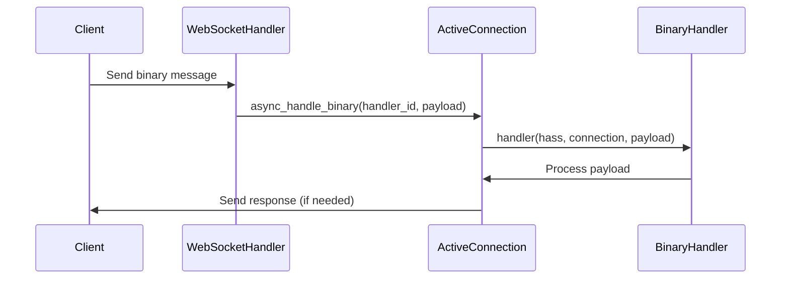

# Binary Handler Registration in WebSocket API

## 1. Entry Point

The binary handler registration flow starts from:
- `homeassistant/components/websocket_api/connection.py` - `ActiveConnection` class
  - `async_register_binary_handler()`: Main method for registering binary handlers
  - `async_handle_binary()`: Method for handling incoming binary messages

## 2. Strategy Design Overview

Binary handlers in the WebSocket API serve a specialized purpose:
- Enable efficient binary data transfer between frontend and backend
- Support use cases requiring raw binary data (e.g., audio streaming, file transfers)
- Provide a way to handle binary messages without JSON serialization overhead
- Allow for temporary, connection-specific handlers that can be cleaned up

## 3. High-Level Flow Overview

The binary handler system works as follows:

1. **Handler Registration**
   - Integrations register binary handlers using `async_register_binary_handler()`
   - Each handler gets a unique ID (1-255)
   - Handler slots can be reused after unregistration

2. **Message Processing**
   - Binary messages use first byte as handler ID
   - Remaining bytes are passed as payload to the handler
   - Handlers are connection-specific and temporary

3. **Key Technical Concepts**
   - Async processing for non-blocking operations
   - Connection-specific handler management
   - Binary message protocol (ID + payload)
   - Automatic cleanup on connection close

## 4. Where Binary Handlers Are Registered

Binary handlers are registered in two main ways:

1. **Direct Registration in Integrations**
   - Integrations can register binary handlers during their setup phase
   - Example from `assist_pipeline/websocket_api.py`:
     ```python
     def handle_binary(
         _hass: HomeAssistant,
         _connection: websocket_api.ActiveConnection,
         data: bytes,
     ) -> None:
         # Forward to STT audio stream
         audio_queue.put_nowait(data)

     handler_id, unregister_handler = connection.async_register_binary_handler(
         handle_binary
     )
     ```
   - This is used for features like audio streaming in the assist pipeline

2. **Dynamic Registration During Command Execution**
   - Handlers can be registered on-demand when processing specific commands
   - Example from test cases:
     ```python
     @callback
     @websocket_command({"type": "get_binary_message_handler"})
     def get_binary_message_handler(hass, connection, msg):
         def binary_message_handler(hass, connection, payload):
             # Handle binary data
             pass
         prefix, unsub = connection.async_register_binary_handler(binary_message_handler)
         connection.send_result(msg["id"], {"prefix": prefix})
     ```
   - This allows for temporary handlers that are cleaned up after use

3. **Built-in Integrations Using Binary Handlers**
   - `assist_pipeline`: For audio streaming and speech-to-text
   - `camera`: For streaming video data
   - `stream`: For handling media streams
   - Other integrations that need to transfer binary data efficiently

## 5. Special Notes & Comments

### USERNOTE Comments
```python
# USERNOTE: This instance is intialized in auth.py during the auth phase.
# USERNOTE: websocket_api/http.py -> websocket_api/auth.py -> websocket_api/connection.py
```
- Context: ActiveConnection initialization flow
- Type: Design decision
- Impact: Shows the connection lifecycle and initialization order

```python
# USERNOTE: HA core specific protocol with frontend to add handle id
```
- Context: Binary message format
- Type: Implementation detail
- Impact: Documents the protocol between frontend and backend

### LLM Comments
```python
# LLM: Interface Documentation
# Purpose: Registers a binary message handler for the current websocket connection
```
- Context: Binary handler registration
- Type: Design documentation
- Impact: Clarifies the purpose and behavior of the registration system

## 6. Entities

### ActiveConnection
- **Location**: `homeassistant/components/websocket_api/connection.py`
- **Purpose**: Manages an active WebSocket connection
- **Key Fields**:
  - `binary_handlers`: List of registered binary handlers
  - `handlers`: Dictionary of command handlers
  - `send_message`: Callback for sending messages

### BinaryHandler
- **Location**: `homeassistant/components/websocket_api/connection.py`
- **Purpose**: Type definition for binary message handlers
- **Signature**: `Callable[[HomeAssistant, ActiveConnection, bytes], None]`

## 7. Call Flow Diagram



## 8. Navigation & Diving In

### Key Files
- [connection.py](../homeassistant/components/websocket_api/connection.py): Core binary handler implementation
- [http.py](../homeassistant/components/websocket_api/http.py): WebSocket connection handling
- [assist_pipeline/websocket_api.py](../homeassistant/components/assist_pipeline/websocket_api.py): Example of binary handler usage

### Next Steps
1. Explore how specific integrations use binary handlers
2. Investigate the binary message protocol in detail
3. Study the cleanup and error handling mechanisms 