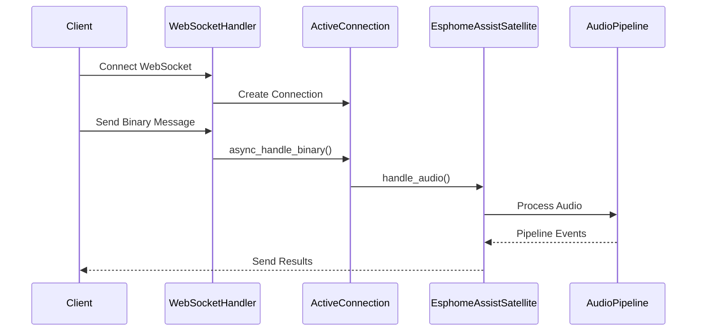

# WebSocket Binary Message Flow: ESPHome Assist Satellite

## 1. Entry Point

### Main Entry Points
- **WebSocket Connection**: `homeassistant/components/websocket_api/http.py`
  - `WebSocketHandler.async_handle()` - Main WebSocket connection handler
  - `WebSocketHandler._async_websocket_command_phase()` - Command phase handler
  - `ActiveConnection.async_handle_binary()` - Binary message handler

- **ESPHome Integration**: `homeassistant/components/esphome/assist_satellite.py`
  - `EsphomeAssistSatellite` class - Main satellite entity
  - `handle_audio()` - Binary audio data handler

## 2. Strategy Design Overview

The WebSocket binary message handling system is designed to efficiently handle real-time data streams, particularly for:
- Audio streaming (voice assistants)
- Video streaming (cameras)
- Large data transfers
- Raw sensor data

This design is crucial for:
1. **Performance**: Bypassing JSON serialization overhead
2. **Real-time Processing**: Direct binary data handling
3. **Resource Efficiency**: Optimized for streaming scenarios

## 3. High-Level Flow Overview

### Core Concepts
1. **Binary Message Protocol**
   ```
   [Handler ID (1 byte)][Payload (remaining bytes)]
   ```
   - First byte identifies the handler
   - Remaining bytes contain the actual data

2. **Handler Registration**
   - Handlers are registered per connection
   - Maximum 255 handlers per connection
   - Handlers can be dynamically registered/unregistered

3. **Message Processing**
   - Binary messages bypass JSON parsing
   - Direct routing to registered handlers
   - Efficient memory handling

### Key Decision Points
1. **Handler ID Size (1 byte)**
   - Trade-off between handler count and message overhead
   - 255 handlers per connection is sufficient for most use cases

2. **Connection-specific Handlers**
   - Each connection maintains its own handler list
   - Allows for connection-specific processing
   - Enables dynamic handler management

## 4. Special Notes & Comments

### USERNOTE Comments
```python
# USERNOTE: This is the main handler for client sent BINARY message
@callback
def async_handle_binary(self, handler_id: int, payload: bytes) -> None:
```
- Context: Binary message handling entry point
- Purpose: Clarifies the role of the handler
- Impact: Highlights the separation between text and binary message handling

### LLM Comments
```python
# LLM: Interface Documentation
# Purpose: Registers a binary message handler for the current websocket connection
# Caveats & Side Effects:
# - Returns a tuple of (handler_id, unregister_callback)
# - Raises RuntimeError if too many handlers are registered (max 255)
```
- Context: Binary handler registration
- Purpose: Documents the registration process and limitations
- Impact: Helps understand handler management constraints

## 5. Entities

### Core Entities

1. **ActiveConnection**
   - File: `connection.py`
   - Purpose: Manages WebSocket connection state and handlers
   - Key Fields:
     - `binary_handlers`: List of registered binary handlers
     - `handlers`: Dictionary of command handlers
     - `send_message`: Message sending callback

2. **WebSocketHandler**
   - File: `http.py`
   - Purpose: Handles WebSocket connection lifecycle
   - Key Methods:
     - `async_handle()`: Connection setup
     - `_async_websocket_command_phase()`: Message processing

3. **EsphomeAssistSatellite**
   - File: `esphome/assist_satellite.py`
   - Purpose: ESPHome voice assistant satellite implementation
   - Key Methods:
     - `handle_audio()`: Processes incoming audio data
     - `handle_pipeline_start()`: Initiates voice processing

## 6. Call Flow Diagram



## 7. Navigation & Diving In

### Source Files
- [WebSocket Handler](../homeassistant/components/websocket_api/http.py)
- [Connection Management](../homeassistant/components/websocket_api/connection.py)
- [ESPHome Satellite](../homeassistant/components/esphome/assist_satellite.py)

### Next Steps
1. Explore binary handler registration in `connection.py`
2. Study message processing in `http.py`
3. Investigate audio pipeline in `assist_satellite.py`
4. Review error handling and cleanup procedures 