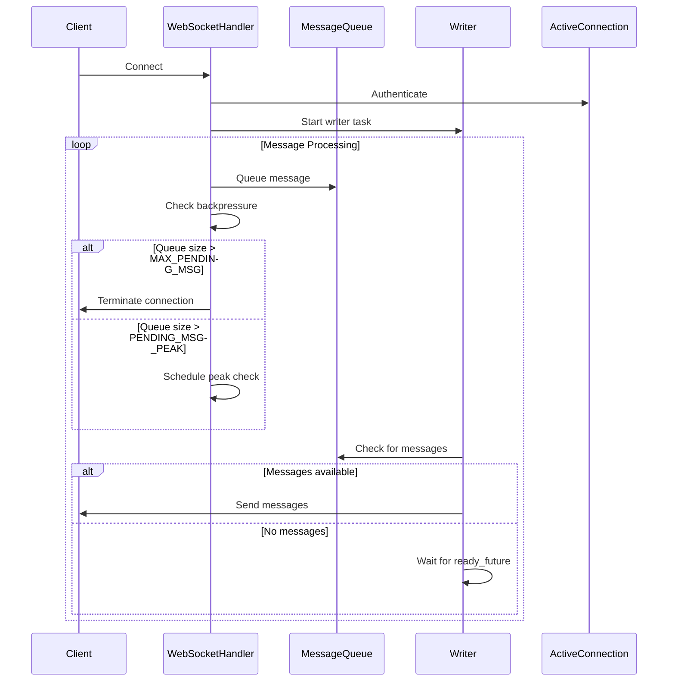

# WebSocket API Message Sending & Backpressure Management

## 1. Entry Point

The main entry point for WebSocket message handling is in:
- `homeassistant/components/websocket_api/http.py`
  - `WebSocketHandler` class
  - `_send_message` method: Core message queuing logic
  - `_writer` method: Message sending loop
  - `_release_ready_future_or_reschedule` method: Backpressure management

## 2. Strategy Design Overview

The WebSocket API serves as the primary real-time communication channel between Home Assistant's core and its frontend clients. The message sending system is designed with these strategic goals:

- **Real-time Responsiveness**: Ensure timely delivery of state changes and events
- **Resource Protection**: Prevent memory exhaustion from message backpressure
- **Performance Optimization**: Balance latency vs throughput through message coalescing
- **Client Protection**: Graceful handling of slow or disconnected clients

This aligns with Home Assistant's overall architecture by providing a reliable, efficient communication layer for the event-driven system.

## 3. High-Level Flow Overview

The message sending system implements a sophisticated backpressure management strategy:

1. **Message Queueing**:
   - Messages are queued in a `deque` for efficient append/pop operations
   - Queue size is monitored to prevent memory exhaustion
   - Hard limit (MAX_PENDING_MSG) triggers connection termination
   - **Message Coalescing Strategy**:
     - When a message is queued, `_release_ready_future_or_reschedule()` is scheduled to the event loop
     - This scheduling allows other consumers (e.g., integrations) to add more messages to the queue
     - When the scheduled task executes, it can process multiple messages together
     - This batching reduces the number of network operations while maintaining reasonable latency

2. **Writer Management**:
   - Dedicated writer task handles message sending
   - Uses a **Future-based signaling system for flow control**
   - Implements message coalescing for batch processing
   - **Event Loop Integration**:
     - `_send_message()` schedules `_release_ready_future_or_reschedule()` to the event loop
     - This allows other async tasks to add messages before the writer is unblocked
     - The writer only processes messages when the future is resolved

3. **Backpressure Detection**:
   - Monitors queue growth rate
   - Implements soft limits (PENDING_MSG_PEAK) for early warning
   - Uses time-based checks to detect sustained backpressure

4. **Resource Protection**:
   - Automatic connection termination for overloaded clients
   - Dynamic buffer size adjustment for authenticated connections
   - Graceful cleanup on connection termination

## 4. Special Notes & Comments

### USERNOTE Comments
1. **Heartbeat Configuration**:
   ```python
   # USERNOTE: HeartBeat: aiohttp will automatically send a ping frame every 55 seconds.
   ```
   - Context: WebSocket connection setup
   - Purpose: Maintains connection health
   - Impact: Prevents stale connections

2. **Writer Task Purpose**:
   ```python
   # USERNOTE: The task represents the writer task that is running in a loop to handle sending messages in the message queue to the client.
   ```
   - Context: Writer task initialization
   - Purpose: Clarifies the role of the writer task
   - Impact: Essential for understanding the message sending architecture

3. **Buffer Size Management**:
   ```python
   # USERNOTE: Increase aiohttp writer write buffer limit to avoid backpressure on aiohttp to cause messages stall in queue and cause memory issue.
   ```
   - Context: Post-authentication optimization
   - Purpose: Explains buffer size adjustment rationale
   - Impact: Critical for performance optimization

4. **Message Coalescing Strategy**:
   ```python
   # USERNOTE: It defer the decision of unblocking the writer to the async _release_ready_future_or_reschedule() method to allow the potential async request on the event loop to invoke send_message() again for accumulating more messages before making decision to unblock the writer.
   ```
   - Context: Message queuing and coalescing strategy
   - Purpose: Explains how message batching is achieved through event loop scheduling
   - Impact: Critical for understanding the performance optimization strategy

### LLM Comments
1. **Backpressure Management Role**:
   ```python
   # LLM: Backpressure Management role: It does NOT directly requesting writer to send message, but instead queue the message in the message queue.
   ```
   - Context: Message queuing strategy
   - Purpose: Explains the indirect control mechanism
   - Impact: Key to understanding the backpressure design

## 5. Entities

### WebSocketHandler
- **File**: `http.py`
- **Purpose**: Manages WebSocket connection lifecycle and message handling
- **Key Methods**:
  - `_send_message`: Queue messages with backpressure checks
  - `_writer`: Process message queue and send to client
  - `_release_ready_future_or_reschedule`: Manage message coalescing

### ActiveConnection
- **File**: `connection.py`
- **Purpose**: Represents an authenticated WebSocket connection
- **Key Properties**:
  - `can_coalesce`: Controls message batching behavior
  - `get_description`: Provides connection identification

## 6. Call Flow Diagram



## 7. Navigation & Diving In

### Key Files for Further Exploration
- `homeassistant/components/websocket_api/http.py`: Core message handling logic
- `homeassistant/components/websocket_api/connection.py`: Connection management
- `homeassistant/components/websocket_api/const.py`: Configuration constants

### Next Steps
1. Investigate message coalescing implementation in `_writer` method
2. Analyze backpressure detection thresholds in `const.py`
3. Review connection cleanup procedures in `_async_cleanup_writer_and_close`
4. Study authentication impact on buffer size management 